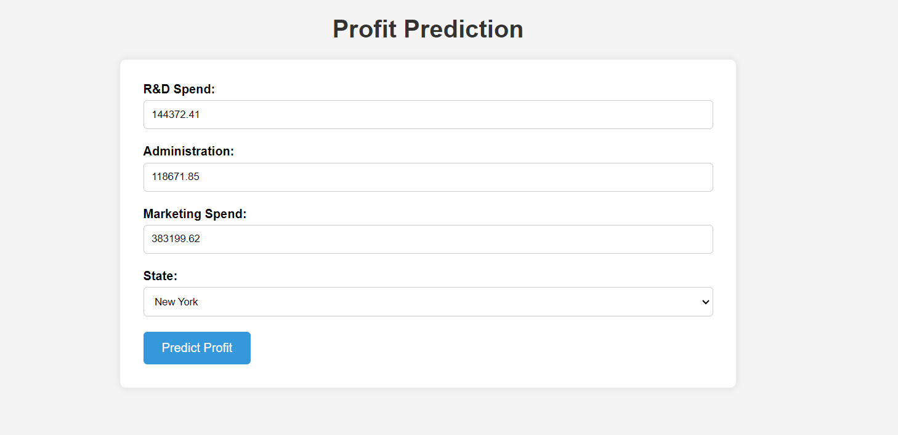

# Profit Prediction Web Application

This web application predicts the profit based on provided features using a machine learning model.

## Features

- Predicts profit based on R&D Spend, Administration, Marketing Spend, and State.
- Provides a user-friendly interface for entering input data.
- Displays the predicted profit on the result page.

## Installation

1. Clone the repository: git clone https://github.com/ronakbediya310/Profit-Prediction-A-Regression-analysis.git

2. Install dependencies

3. Run the Flask application:

4. Open your web browser and navigate to [http://localhost:5000](http://localhost:5000) to use the web application.

## Usage

1. Enter the values for R&D Spend, Administration, Marketing Spend, and State in the input form.
2. Click the "Predict" button to see the predicted profit.
3. The predicted profit will be displayed on the result page.

## Contributing

Contributions are welcome! For major changes, please open an issue first to discuss what you would like to change.

## Implementation

